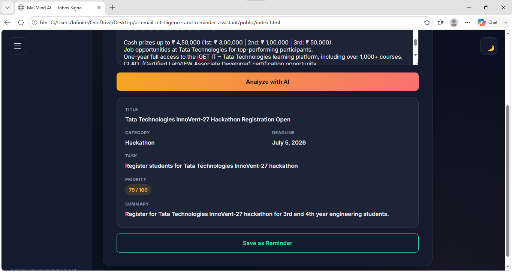
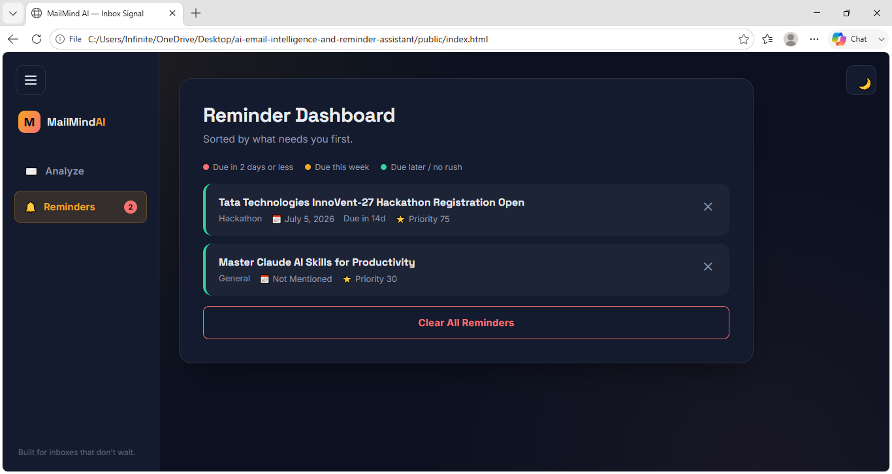
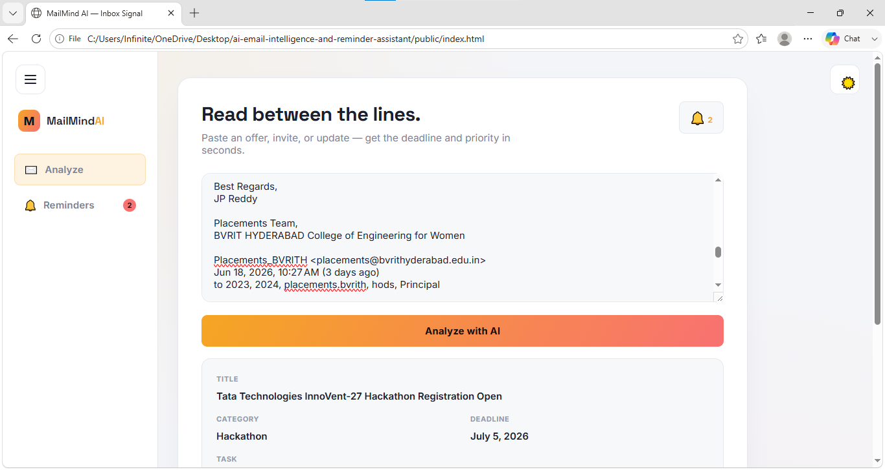

# ai-email-intelligence-and-reminder-assistant
# MailMind AI 📧🧠

**Never miss a deadline buried in your inbox.**

MailMind AI reads through internship offers, hackathon invites, workshop announcements, HR updates, and meeting reminders — and instantly tells you what matters: the deadline, the priority, and what action you actually need to take.

---

## 📸 Screenshots

### Email Analysis
Paste any email and get an instant structured breakdown.



### Reminder Dashboard
Reminders sorted by urgency, with color-coded deadlines.



### Light Mode



---

## ✨ Features

- **AI-powered email analysis** — paste any email and get back a clean breakdown: title, category, task, deadline, priority score, and a one-line summary.
- **Smart reminders dashboard** — save analyzed emails as reminders, sorted automatically by what's most urgent.
- **Deadline urgency color-coding** — reminders are visually flagged:
  - 🔴 Red — due in 2 days or less
  - 🟡 Amber — due within the week
  - 🟢 Green — due later, no rush
- **Urgent alerts in the bell icon** — a pulsing indicator appears the moment any reminder is close to its deadline.
- **One-click delete** — remove individual reminders without clearing everything.
- **Light/dark theme toggle** with a collapsible sidebar.
- **Fully responsive UI** — works cleanly on desktop and mobile.

---

## 🛠️ Tech Stack

**Frontend:** HTML, CSS, vanilla JavaScript (no frameworks — fast, lightweight, dependency-free)
**Backend:** Node.js, Express
**AI:** Google Gemini API (`gemini-2.5-flash-lite`)
**Storage:** Browser `localStorage` (reminders persist per-device, no database required)

---

## 📂 Project Structure

```
ai-email-intelligence-and-reminder-assistant/
├── public/
│   ├── index.html      # App UI
│   ├── style.css        # Styling and theme
│   └── script.js        # Frontend logic (analysis parsing, reminders, urgency coding)
├── server.js             # Express backend, talks to Gemini API
├── package.json
├── .env.example          # Template for required environment variables
└── .gitignore
```

---

## 🚀 Getting Started (Local Setup)

### 1. Clone the repo
```bash
git clone https://github.com/TABASSUMBEGUM-1/ai-email-intelligence-and-reminder-assistant.git
cd ai-email-intelligence-and-reminder-assistant
```

### 2. Install dependencies
```bash
npm install
```

### 3. Set up your environment variables
Copy the example file and add your own Gemini API key:
```bash
cp .env.example .env
```
Then open `.env` and fill in:
```
GEMINI_API_KEY=your_gemini_api_key_here
```
Get a free key at [Google AI Studio](https://aistudio.google.com/app/apikey).

> ⚠️ Never commit your real `.env` file. It's already excluded via `.gitignore`.

### 4. Start the backend
```bash
node server.js
```
You should see:
```
Server running on port 3000
```

### 5. Open the frontend
Open `public/index.html` directly in your browser, or serve it with a local static server (e.g. VS Code's "Live Server" extension) for the smoothest experience.

The frontend talks to the backend at `http://localhost:3000` by default — make sure the backend is running before clicking **Analyze**.

---

## 🌐 Deployment

- **Backend** → deploy to [Render](https://render.com) or [Railway](https://railway.app). Set `GEMINI_API_KEY` as an environment variable on the platform.
- **Frontend** → deploy to [Vercel](https://vercel.com) or [Netlify](https://netlify.com). Update the API base URL in `index.html` to point to your deployed backend.

---

## ⚠️ Known Limitations

- Reminders are stored in browser `localStorage`, so they're local to one device/browser and not synced across sessions or devices.
- Gemini's free tier has a daily request quota (20 requests/day on some models) — heavy testing can temporarily exhaust it.
- Gmail inbox integration is not yet implemented — planned for a future version.

---

## 🔮 Planned / Future Improvements

- [ ] Direct Gmail inbox integration to auto-pull emails for analysis
- [ ] Email/push notifications for upcoming deadlines
- [ ] Edit saved reminders
- [ ] Search and filter reminders by category
- [ ] Persistent storage with a real database for multi-device sync

---

## 👩‍💻 Author

Built by **Tabassum** — B.Tech CSE (AI & ML), BVRIT Hyderabad College of Engineering for Women.

---

## 📄 License

ISC